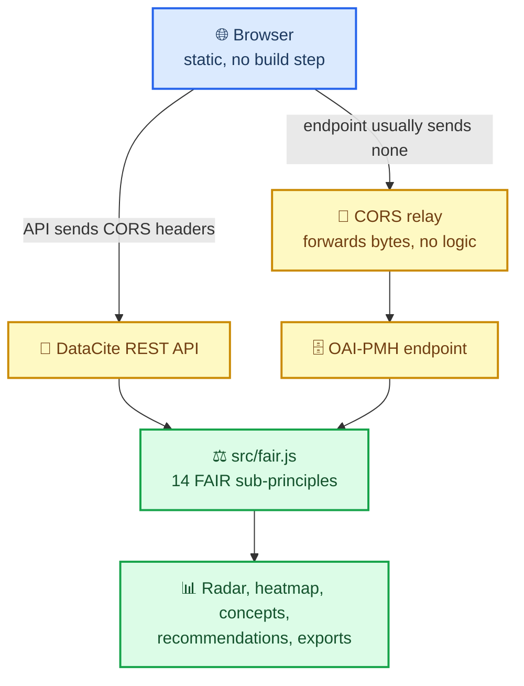

# fair-repo-audit

[](https://doi.org/10.5281/zenodo.21492530)

**Score the FAIR metadata quality of any DataCite or OAI-PMH repository, entirely in your browser.**

A static, dependency-free web app. Point it at a DataCite client / prefix / publisher, or an
OAI-PMH base URL, and it harvests live metadata and scores every record against **14 FAIR
sub-principles**. Nothing is uploaded or stored; all computation runs client-side.

One mode is the exception, and it says so on the page: **Source vs published** reads a
repository's own API alongside its published DataCite records, and that comparison runs in a
service rather than in your browser. See [What runs where](#what-runs-where).

Built for repository managers, data stewards and research-data support staff: anyone who has to
answer "how good is our metadata, really?", ideally before someone else asks.

🔗 **Live:** https://rijdho.github.io/fair-repo-audit/

Available in **English, Spanish and German** (auto-detected, switchable).


This is the **open twin** of [Repo MetAudits](https://metaudits.rijdho.org/repo-metaudits/).
That tool keeps its scoring engine server-side (protected); this one moves the *same* rubric
into the browser where it is fully visible: inspired by the open, client-side philosophy of
[Metadata Game Changers](https://metadatagamechangers.com/). The scoring logic in
[`src/fair.js`](src/fair.js) is a faithful port of the production engine, so scores match.

## Watching a repository over time

Two views ask a different question from "how good is this metadata": they ask whether anyone is
still working on it.

- **History** scores each *registration* cohort separately. Publication year says when the science
  happened; `registered` says when the DOI was minted, which is when the metadata was written. A
  repository whose 2015 and 2025 cohorts score the same is minting from an unchanged template, and
  a single overall score cannot tell that apart from steady improvement. Alongside it, a curation
  activity chart counts records registered against records edited in each year: registration
  without editing is a deposit-and-forget collection.
- **Re-curation** replays a single DOI's audit log (`/dois/{doi}/activities`), showing what changed
  at each revision and what the record scored at each one. Metadata curation leaves no trace in the
  record you see today, so this is the view that makes it visible, and it is also the one that
  catches an edit that made a record worse.

  DataCite does not always retain the `create` entry. Where the log starts mid-life the changes are
  still exact, but the scores are withheld rather than computed from a partial reconstruction: that
  would report a decent record as a terrible one, with a number that looks entirely plausible.

Both run in your browser against the public DataCite API.

## Watching it change: metrics-watch

A one-off audit says where you are. It cannot say whether you are getting better, and it cannot
show a funder or a director that a curation effort worked. `metrics-watch` turns the same rubric
into a time series that lives in your own repository.

1. Fork this repository.
2. Copy `metrics-watch.example.json` to `metrics-watch.json` and edit the targets.
3. That is the whole setup. On the first of every month the workflow scores each target and commits
   `metrics-history.json` back to your fork.

No account, no key, no service: the scorer is [`scripts/metrics-watch.mjs`](scripts/metrics-watch.mjs),
it has no dependencies, and it imports the same `src/fair.js` the page uses, so a scheduled score
and a score you read in the browser cannot drift apart. It also runs by hand:

```sh
node scripts/metrics-watch.mjs --mode prefix --value 10.7284 --out metrics-history.json
```

The **Metrics** view reads any such history, by URL or from a local file, and plots the trend. More
than one target in a config makes a set, and the view compares them on one axis.

A history file holds runs, not records: date, sample size, the overall score, all fourteen
sub-principle scores and the concept percentages. It stays small enough to accumulate for years,
and keeping the sub-principle scores means an old history can be re-analysed later in ways nobody
has thought of yet.

## What runs where

Almost everything here runs in your browser, and that is a promise rather than an
implementation detail, so it is worth being precise about the one exception.

| Mode | Where the analysis runs | What leaves your browser |
|---|---|---|
| DataCite | your browser | nothing |
| OAI-PMH | your browser (records may pass through a CORS relay that holds no scoring logic) | the endpoint URL you typed |
| Compare | your browser | nothing |
| **Source vs published** | **a hosted service** | **the repository and value you chose** |

The scoring rubric is the same in all four: [`src/fair.js`](src/fair.js), fully
visible, 14 sub-principles. What the service adds is the connectors that read a
repository's *native* API and the element ledger that compares the two sides.
Those are not in this repository.

Why the split. Every FAIR auditing tool, this one included, reads the record a
repository *publishes*. That is the thin side. A repository usually knows a good
deal more about a dataset than it writes into the record, and the difference is
invisible to anything that only sees the output. Reading both sides needs a
connector per repository, which is ongoing work rather than a rubric, and it is
where this project earns its keep.

## What it measures

Every record is scored against 14 FAIR sub-principles (Wilkinson et al. 2016), each **Full (1)**,
**Partial (0.5)**, or **Not met (0)**:

| | Checks |
|---|---|
| **F** Findable | F1 persistent identifier · F2 metadata richness · F3 identifier in metadata · F4 searchable registration |
| **A** Accessible | A1 standardized protocol · A1.1 open/free protocol · A2 metadata persistence |
| **I** Interoperable | I1 formal schema · I2 controlled vocabularies · I3 qualified references |
| **R** Reusable | R1 attribute richness · R1.1 machine-readable license · R1.2 provenance (ORCID/ROR/funding) · R1.3 community standards |

### Beyond the score

- **Concept completeness**: the share of records carrying each concrete field (Abstract, Keyword
  vocabulary, Author ORCID, Affiliation ROR, Contact person, Funder ID, Award number…), grouped
  into Habermann's four use cases (Text / Identifiers / Connections / Contacts).
- **FAIR profile radar**: the repository's shape across F/A/I/R, with the mean plus every record
  overlaid so you see the profile *and* the spread. In **Compare** mode, two repositories' shapes
  are overlaid on one radar.
- **Per-record heatmap**: every record × every check (worst records first), hover any cell.
- **Reusability readout**: licence clarity, provenance and standards synthesised into one
  "can others reuse this?" verdict.
- **FAIR over time**: mean FAIR by publication year, with a trend takeaway.
- **Possible duplicates**: records sharing a normalized title.
- **Per-check detail**: what each check evaluates, a full/partial/not-met split, a fix
  recommendation, and a drill-down to the exact records below full. Click a FAIR gauge to peek at
  one principle inline.
- **Year focus**: narrow what's assessed by year. On **DataCite** it filters by *publication
  year*, and **Suggest years** draws the repository's records-per-year distribution (reconstructed
  from cheap count-only queries) so you can click a bar to focus a range. On **OAI-PMH** it filters
  by record *datestamp* (when a record was added/updated in the repo, not publication year), using
  the protocol's native `from`/`until` selective harvesting.
- **Metadata format** (OAI-PMH): which format to harvest, defaulting to *richest available*:
  the app asks the endpoint what it can emit and takes the best format it can parse. This
  matters most on **DSpace**, whose mandatory `oai_dc` output flattens every qualifier away:
  `rights.uri`, `identifier.orcid`, `identifier.ror` and `language.iso` arrive stripped or not
  at all, so scoring a DSpace repository on `oai_dc` reads as poorer than the repository is.
  **DIM** (DSpace Intermediate Metadata) is parsed natively and keeps those qualifiers.
- **Compare**, two repositories side by side (DataCite or OAI-PMH): overall, per-principle,
  concept diff, and the dual radar.
- **How it works**, an in-app guide (its own tab): the four-step story for newcomers, then
  expandable depth: the 14 checks one by one (rendered from the same catalogues the results
  use), the scoring bands, and where the data comes from. Available in all three languages.
- **License & connectivity profiles**, prioritized recommendations, and **JSON / text / CSV**
  export, including an **Action list (CSV)**: every record that isn't full on a check, with the
  reason (a re-curation to-do list).


### Share a result

Every analysis is captured in the URL, so results are bookmarkable and shareable. Examples:

```
…/fair-repo-audit/?tab=datacite&kind=clientId&q=dryad.dryad&n=100
…/fair-repo-audit/?tab=datacite&kind=clientId&q=dryad.dryad&n=25&y0=2015&y1=2020
…/fair-repo-audit/?tab=compare&ak=clientId&av=dryad.dryad&bk=clientId&bv=gdcc.harvard-dv&n=25
…/fair-repo-audit/?tab=datacite&kind=prefix&q=10.5281&n=100&lang=de
…/fair-repo-audit/?tab=oai&q=https://repositorio.example.cl/oai/request&n=100&f=dim
```

`f` pins the OAI-PMH metadata format; omit it to let the app pick the richest one the
endpoint offers.

Opening such a link runs the analysis automatically. `lang` is optional and pins the
interface language, so a result can be shared with a colleague in their own language.

## Languages

The interface, the per-check explanations and the fix recommendations are available in
**English, Spanish and German**. Language is picked in the top bar and resolved
at load in this order: `?lang=` → previous choice (`localStorage`) → `navigator.languages`
→ English. Switching relabels whatever is already on screen without re-querying the API.

What is *not* translated, in any locale, is deliberate: metadata schema field names
(`rightsURI`, `subjectScheme`, `relatedIdentifiers`, `dc:title`…), standard and
organisation names (DataCite, OAI-PMH, Dublin Core, ORCID, ROR, SPDX, ISO 639…), and the
JSON/CSV export keys. Those are strings the user types into a metadata editor or feeds to
a script: translating them would break the very fix the tool is recommending. The
human-readable `.txt` report *is* translated; the machine-readable exports are not.

### Adding or correcting a language

Catalogues are plain ES modules of flat, dotted keys: `src/i18n/en.js` is the source of
truth, and the others are measured against it:

```bash
node --test tests/i18n.test.mjs
```

That suite fails on a missing key, an orphan key from a typo, a `{placeholder}` that was
dropped or renamed in translation, a broken plural pair, and on long values left identical
to English. A missing key is never fatal at runtime (it falls back to English), so a
partial locale degrades to mixed language rather than to blank UI.

To add a language: copy `en.js`, translate the values, register the code and its endonym
in `LANGS` in `src/i18n/index.js`, and import it into `LOCALES`.

## Architecture

The two sources reach the engine by different routes, and that asymmetry is the only
non-obvious thing about the design:



```
Browser (GitHub Pages, static, no build step)
├── src/fair.js      OPEN: the FAIR engine (14 sub-principles), a faithful port
├── src/datacite.js: DataCite REST client (CORS-enabled → direct, no proxy)
├── src/oaipmh.js: OAI-PMH client (DOMParser) + DIM crosswalk; via a thin CORS relay
├── src/concepts.js: concept-completeness definitions (keys only; text lives in i18n)
├── src/analysis.js: temporal trend + duplicate detection
├── src/charts.js    radar, heatmap, temporal (SVG), dependency-free
├── src/i18n/: en · es · de catalogues + a ~140-line t() runtime
└── src/app.js: UI

cors-proxy/          : a ~40-line CORS relay, required for OAI-PMH (no scoring logic)
```

- **DataCite** needs no server: the API sends CORS headers, so the browser queries it directly.
  `affiliation=true` is always set (without it DataCite strips ROR affiliation identifiers).
- **OAI-PMH** endpoints rarely send CORS headers, so those requests pass through a **dumb byte
  relay**. It holds no logic: it just forwards the GET and adds CORS headers. **No relay is
  shipped as a default**, on purpose: a hardcoded one would route every visitor's traffic through
  a single account and publish that account's hostname here. Deploy your own from
  [`cors-proxy/`](cors-proxy/) and paste its URL into the app's *CORS proxy* field, so this tool
  never depends on anyone else's infrastructure. DataCite needs no relay and is unaffected.

## Tests

The engine and analysis modules are pure functions, covered by unit tests (Node's built-in
runner, no dependencies):

```bash
node --test tests/*.test.mjs
```

`fair.test.mjs` and `analysis.test.mjs` assert on **scores**, and those fixtures double as
the parity contract with the server-side engine in Repo MetAudits: a change that flips an
expected score should be mirrored there or documented as a divergence. Because they cover
scores rather than wording, they stayed green throughout the i18n extraction: which is the
point, but also means they cannot vouch for the prose. `i18n.test.mjs` covers that side:
locale parity, placeholder integrity, and the structural contracts the UI parses.

## Run locally

No build step. Serve the folder with any static server:

```bash
python3 -m http.server 8000    # then open http://localhost:8000
```

## Deploy the CORS proxy (optional, for OAI-PMH)

```bash
cd cors-proxy
npx wrangler deploy            # prints https://…workers.dev
```

Paste `https://…workers.dev/?url=` into the app's *CORS proxy (advanced)* field.

## Methodology & validation

The rubric, the Full/Partial/None bands, and the source-capability-aware scoring are documented
in [Repo MetAudits' METHODOLOGY.md](https://metaudits.rijdho.org/repo-metaudits/) and
cross-validated against the independent [FAIR-Checker](https://fair-checker.france-bioinformatique.fr/)
tool. Because the engine here is a faithful port, those results carry over.

## Caveats

- **Directional, not authoritative.** The scores are a structured prompt for re-curation, not a
  certification. Two repositories on the same score can be in very different places.
- **It scores metadata, not data.** Every check runs against the metadata record as the API
  exposes it. Whether the described dataset is actually retrievable, documented or usable is
  outside what this tool can see.
- **A sample, not a census.** Each run scores the `n` records the query returned, not the whole
  repository. Widen the sample before reading any number as *the* repository's score.
- **DataCite and OAI-PMH results are not directly comparable.** The two surfaces expose different
  things, and **Year focus** means different things on each: publication year on DataCite, record
  datestamp on OAI-PMH.
- **Nor are two OAI-PMH runs on different metadata formats.** A format decides what the checks can
  even see, so a score always belongs to the format it was harvested in. Pin `f=` before comparing
  a repository against itself over time. A measured example, from a 1,958-record DSpace census:
  `oai_dc` reports `dc:format` on 56 records where `dim` reports none, because DSpace's oai_dc
  crosswalk synthesises that element from the bitstream MIME type while DIM carries only real
  metadata fields. Four of those records consequently cross a scoring band. Richer is not
  uniformly higher.
- **A generic FAIR score is not a conformance check.** These 14 sub-principles reward having a
  standardized protocol and populated fields; they do not ask whether the values sit in the
  controlled vocabularies a national or regional aggregator requires (COAR resource types,
  `info:eu-repo` access rights, ISO 639 language codes). A repository can score well here and
  still be uncosechable by OpenAIRE or a national node. Read the concept completeness beside
  the score, not the score alone.
- **The radar is a shape, not a score.** With its axes in a fixed order, the polygon's area and
  outline carry no meaning: read the per-principle numbers, not the picture.

## License

[AGPL-3.0-or-later](LICENSE): read, cite, fork and adapt freely; if you run a modified
version as a network service, share your changes under the same license. Releases up to
1.3.0 were published under MIT and remain so.

## Citation

If you use this tool or its rubric, please cite it: see [`CITATION.cff`](CITATION.cff) or the
"Cite this repository" button. Archived on Zenodo: concept DOI
[10.5281/zenodo.21492530](https://doi.org/10.5281/zenodo.21492530) (always resolves to the
latest version).
